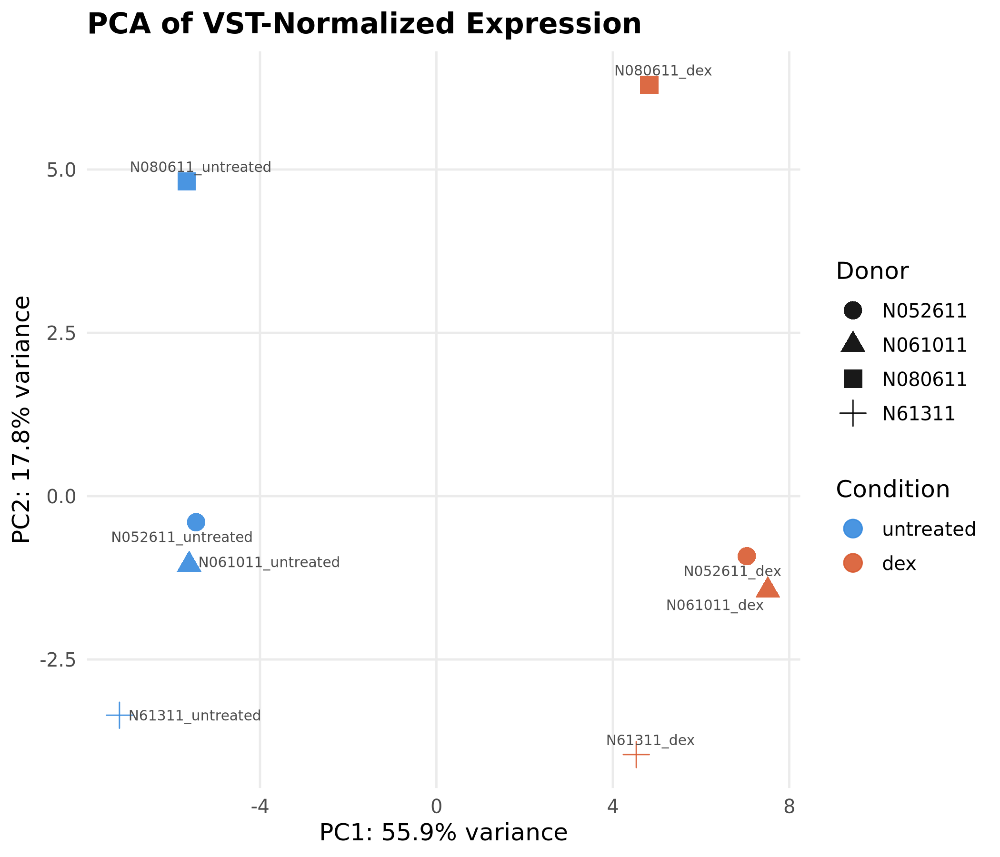
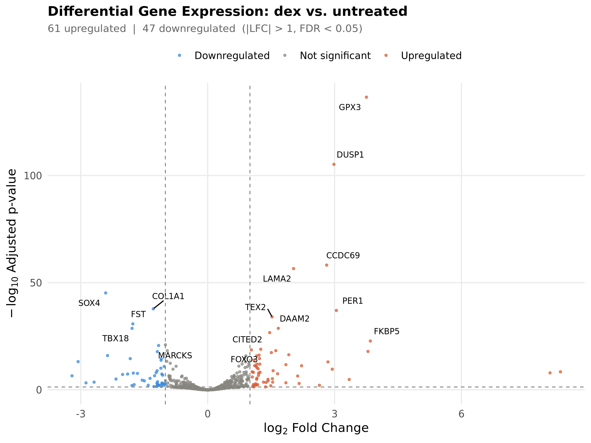
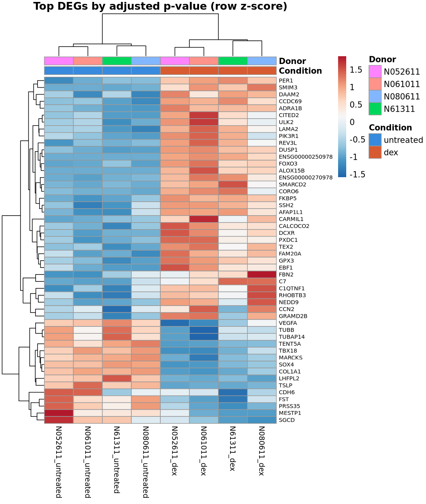
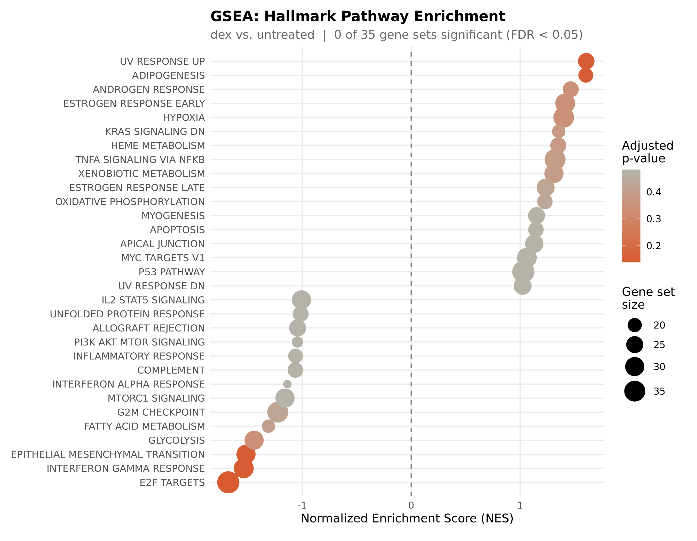

# RNA-seq Differential Expression Pipeline

A reproducible Snakemake workflow that takes raw paired end reads to differentially expressed genes and pathway enrichment, run end to end on a real public dataset: dexamethasone treated versus untreated human airway smooth muscle cells (GEO GSE52778), scoped to three chromosomes so it runs on a laptop.

## Technologies used

Snakemake 7.32, FastQC 0.11.9, Trimmomatic 0.39, STAR 2.7.10b, samtools 1.17, featureCounts (subread 2.0.3), MultiQC 1.14, DESeq2 1.42 (apeglm shrinkage), clusterProfiler 4.10 with MSigDB Hallmark gene sets (msigdbr 7.5.1), R 4.3, Python 3.10, conda. All versions are pinned in `environment.yml`.

## Biological background

Glucocorticoids such as dexamethasone are widely used to treat asthma because they switch off inflammatory programs in airway cells, and they do so by changing the expression of hundreds of genes. RNA sequencing measures those changes genome wide, and differential expression analysis asks which genes move more than natural variation between samples would explain. This project reproduces that analysis from raw reads, and uses a handful of genes with a well known glucocorticoid response (DUSP1, FKBP5, PER1) as a sanity check that the pipeline recovers real biology.

## Dataset

* **Source:** GEO GSE52778 (ENA project PRJNA229998), airway smooth muscle cells from four donors, each measured untreated and after dexamethasone. The albuterol arms of the study are not used.
* **Design:** 8 runs, 4 donors, paired (each donor contributes one untreated and one dex sample). Illumina HiSeq 2000, 63 bp paired end reads.

| Donor | Untreated | Dex |
|---|---|---|
| N61311 | SRR1039508 | SRR1039509 |
| N052611 | SRR1039512 | SRR1039513 |
| N080611 | SRR1039516 | SRR1039517 |
| N061011 | SRR1039520 | SRR1039521 |

* **Subsetting (done to fit a 7 GB RAM machine):**
  * Reads: the first 5,000,000 read pairs of each run (about 4 GB in total), streamed from ENA by `scripts/download_data.sh`, which checks gzip integrity and the exact read count of every file.
  * Reference: GRCh38 chr5, chr6 and chr17 only, with the GENCODE v44 annotation filtered to the same chromosomes (9,418 genes in the count matrix).
* **Committed data:** `data/processed/example_fastq/` holds the first 1,000 read pairs of every sample for browsing. Full reads, the reference and alignments are gitignored and recreated by the pipeline.

## Workflow and methods

1. **Download** (`scripts/download_data.sh`): read subsets and the scoped reference described above.
2. **FastQC** on raw reads.
3. **Trimmomatic** (paired end): ILLUMINACLIP with TruSeq3 adapters (2:30:10), LEADING 3, TRAILING 3, SLIDINGWINDOW 4:15, MINLEN 36.
4. **FastQC** on trimmed reads.
5. **STAR index**: sjdbOverhang 62 (read length minus 1), genomeSAsparseD 2 to halve index memory.
6. **STAR alignment**: coordinate sorted BAM, attributes NH HI AS NM MD, unmapped reads kept in the BAM.
7. **featureCounts**: fragment level counting (paired end, `--countReadPairs`), exon features grouped by gene, mapping quality at least 10. Library strandedness was measured, not assumed: `scripts/check_strandedness.sh` compares assigned fragments under each strand setting (results in `results/tables/strandedness_check.tsv`), and the library is unstranded, so strand is 0.
8. **DESeq2**: genes with fewer than 10 total counts removed, Wald test, paired design `~ donor + condition`, contrast dex versus untreated, apeglm log2 fold change shrinkage. A gene is called differentially expressed at adjusted p below 0.05 and absolute log2 fold change above 1. Plots use variance stabilized counts.
9. **GSEA**: genes ranked by the DESeq2 Wald statistic (by gene symbol), MSigDB Hallmark sets of 15 to 500 genes, Benjamini Hochberg adjustment, seed 42. Every tested set is reported with a significance flag at FDR 0.05.
10. **MultiQC**: one report covering FastQC (raw and trimmed), Trimmomatic, STAR and featureCounts.

Every parameter above lives in `config/config.yaml`, with comments explaining the reasoning.

## How to run it

Requires Linux, macOS or WSL2 (the bioconda tools are not available natively on Windows), conda or mamba, about 20 GB of free disk and at least 7 GB of RAM.

```bash
git clone https://github.com/MohamedElsaid-bit/rna-seq-differential-expression-pipeline.git
cd rna-seq-differential-expression-pipeline

bash setup.sh                     # creates the "snakemake" conda environment
conda activate snakemake

bash scripts/download_data.sh     # reads and reference (needs internet)

snakemake --dry-run --cores 1 --use-conda --conda-frontend conda
snakemake --cores 16 --use-conda --conda-frontend conda --resources mem_mb=6500
```

Use `--conda-frontend conda`: Snakemake 7.32 cannot build environments through mamba 2.x. For a bigger machine, raise `--resources mem_mb` and adjust the scoped reference in `config/config.yaml`.

**Expected runtime:** the data download took roughly two to three hours in the reference run and is limited by ENA stream speed. The workflow itself took about 30 to 40 minutes on 20 threads, including the first build of the conda environment. A GitHub Actions workflow (`.github/workflows/snakemake_dry_run.yml`) checks on every push that the workflow graph resolves (38 jobs).

## Results and interpretation

All numbers below come from files committed in `results/`. The full QC report is [results/qc/multiqc_report.html](results/qc/multiqc_report.html).

### Do the known dexamethasone genes come up?

Yes. All three known responsive genes on the scoped chromosomes are strongly induced:

| Gene | Chromosome | log2 fold change | Adjusted p |
|---|---|---|---|
| DUSP1 | chr5 | 2.99 | 6.0e-106 |
| PER1 | chr17 | 3.04 | 9.5e-38 |
| FKBP5 | chr6 | 3.85 | 1.7e-23 |

These are roughly 8 fold, 8 fold and 14 fold increases. TSC22D3 (chrX), KLF15 (chr3) and other classic responders are not on the three chromosomes, so they could not be tested. This is a sanity check on three genes, not a validation against a published gene list.

### Sample structure (PCA)



Principal component 1 (55.9% of variance) separates every dex sample from every untreated sample, with no overlap, so the treatment is the dominant signal. Principal component 2 (17.8%) mostly separates donor N080611 from the others, which shows real donor to donor variation and is the reason for the paired design.

### Differential expression



Of 3,543 genes tested after filtering, 341 have an adjusted p below 0.05, and 108 also pass the fold change threshold (61 up, 47 down). The most significant gene is GPX3 (log2 fold change 3.75, adjusted p 2.7e-137), followed by DUSP1. The MA plot is in `results/figures/ma_plot.png`.



The 50 most significant genes split the eight samples first by condition and only then by donor, matching the PCA. Two of the 50 genes have no gene symbol in the annotation and are shown by Ensembl ID.

### Pathway enrichment



No Hallmark gene set is significant: 35 sets were testable and the best adjusted p is 0.139 (E2F targets, enriched in untreated). This is a limit of the scoping, not a finding. With only 3,539 ranked genes from three chromosomes, each gene set keeps a fraction of its members, and the test has little power. The table with all 35 sets is in `results/tables/gsea_results.tsv`, and the pathway ordering in the figure should not be interpreted biologically.

### Quality control and anomalies

* **Low mapping rate is expected.** Between 21.3% and 23.8% of read pairs map uniquely (4.69 to 4.83 million pairs entered STAR per sample). The reads come from the whole genome but the reference is three chromosomes, so most reads have nowhere to align. Of the mapped pairs, 848,695 to 953,326 fragments per sample were assigned to genes.
* **Trimming was light:** 93.9% to 96.6% of pairs survived paired trimming.
* **FastQC:** raw reads pass every module except sequence duplication (warning in all 16 files, deduplicated fraction 64% to 69%, normal for RNA sequencing where highly expressed genes are read many times, so reads were not deduplicated) and overrepresented sequences (warning in 3 of 16 files). Trimmed reads add a warning on sequence length distribution, which is expected once reads have variable lengths.
* **Two extreme fold changes:** ALOX15B and ENSG00000250978 show log2 fold changes of about 8, but have zero counts in all four untreated samples and 16 to 48 in every dex sample, so they are genuinely switched on. Their fold change sizes are very uncertain (standard error about 2.7) and should not be read as precise.
* **Library type:** unstranded, measured from the alignments (1,883,727 assigned fragments under strand 0 versus about 1,072,000 under strand 1 or 2 on two samples).

## Limitations

* **Scope:** three chromosomes cover a fraction of the genome, so nothing here is a genome wide statement, and some well known dexamethasone genes cannot be tested.
* **Read subsetting:** only the first 5 million pairs of each run are used, and the head of a FASTQ file is not a random sample (it comes from a limited set of flowcell tiles). About 1 million mapped pairs per sample is far less depth than the full study, so power is lower and fold changes for low count genes are less stable.
* **Sample size:** four donors, one measurement each per condition.
* **Enrichment power:** GSEA found nothing significant, and results at this scale should not be used to draw pathway conclusions.
* **Validation:** the check against known genes covers three genes, and results were not compared against the published analysis of this dataset.
* **Strandedness** was measured on two of the eight samples.
* **Tooling:** the pipeline was run once on one machine. Snakemake 7.32 needs `--conda-frontend conda`, as noted above.

## Future improvements

1. Run the full genome with a larger machine or HPC (whole genome STAR indexing needs about 32 GB of RAM) and compare the results to the scoped run.
2. Replace the head of file subset with a random subsample, or use all reads, to remove the tile bias.
3. Compare the differentially expressed gene list against the published airway analysis for a quantitative validation.
4. Add GO and KEGG over representation analysis alongside Hallmark GSEA, and check quantification against an independent tool.
5. Package the workflow with containers and a lock file for exact reproducibility, and add continuous integration that runs the small example subset end to end.

## Contact and links

Mohamed Elsaid, M.S. Bioinformatics, Johns Hopkins University.

* GitHub: [github.com/MohamedElsaid-bit](https://github.com/MohamedElsaid-bit)
* Portfolio: [mohamedelsaid-bit.github.io/Portfolio-](https://mohamedelsaid-bit.github.io/Portfolio-/)
* Related projects: [variant calling pipeline](https://github.com/MohamedElsaid-bit/variant-calling-pipeline), [biomedical ML classification](https://github.com/MohamedElsaid-bit/biomedical-ml-classification)

Released under the MIT License (see [LICENSE](LICENSE)).
